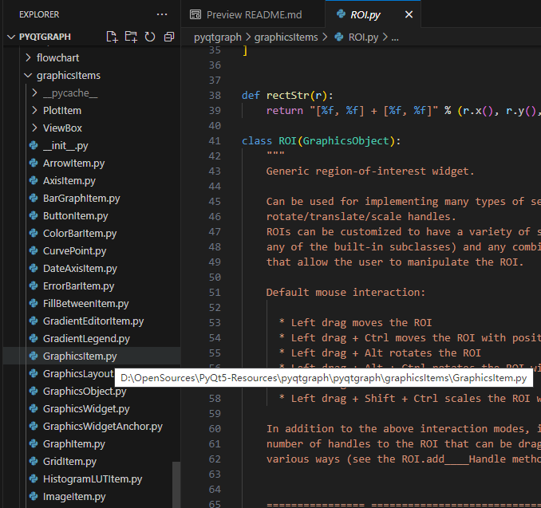
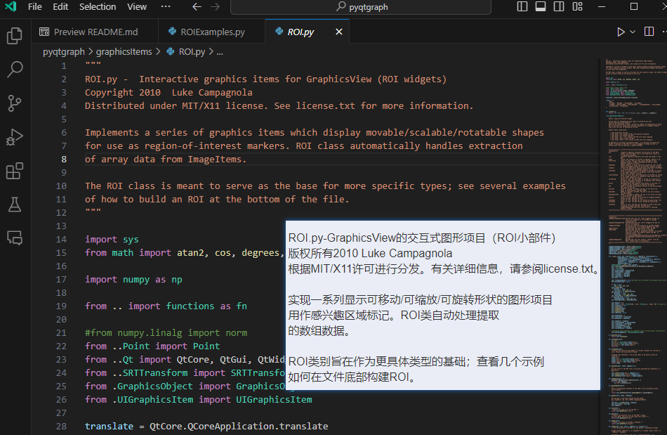

- 基于PyQt来实现一个截图工具，整体的截图体验参考Snipaste的样式，绘图体验则借鉴excalidraw
- ## 功能特点
	- 截图
		- 选区截图，类似snipaste
		- 多屏幕截图支持，类似snipaste
		- 自识别选区截图，类似snipaste
		- 滚动截图，参考[Jamscreenshot](https://github.com/fandesfyf/Jamscreenshot)
	- 贴图
		- 将截图钉到屏幕上，类似snipaste
		- 贴图闪屏效果支持
		- 鼠标穿透支持
	- 通用白板绘图（`截图标注`、`桌面标注`），考虑编写一个PyQt版本的通用绘图库，整体操作参考excalidraw的操作习惯，对svg支持友好
		- 矩形
		- 椭圆
		- 文本
		- 线条（含贝塞尔线条、折线）
		- 橡皮擦
		- 箭头
	- OCR&翻译
	- 快捷键自定义
	- 多语言支持
- 参考资料
	- https://maicss.gitbook.io/pyqt-chinese-tutoral/
	- https://github.com/fandesfyf/Jamscreenshot
	- https://zh.snipaste.com/
	- https://github.com/pyqtgraph/pyqtgraph
	- https://gitlab.com/pavel.krupala/pyqt-node-editor
		- 建议先跟着这个教程开发一个节点编辑器，然后熟悉QGraphicView的相关开发技术，方便自行来实现各种绘图工具
		- {{video https://www.youtube.com/watch?v=YV2mEYd7nyM&list=PLZSNHzwDCOggHLThIbCxUhWTgrKVemZkz&index=2}}
	- 对于如何绘制现有图元这个东西来说，可以从pygraph这个第三方库里提取出来，如下图所示：
		- 
		- 