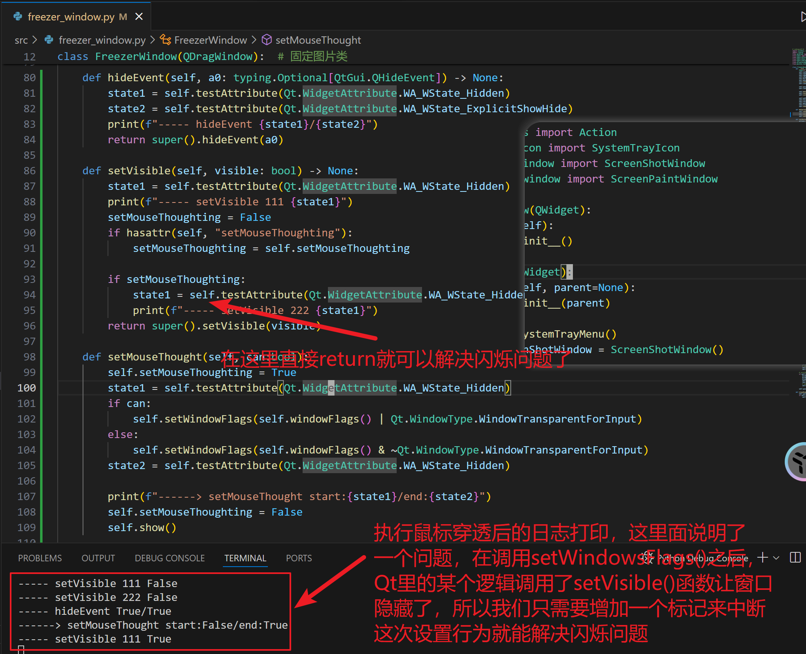

- >分析了Snipaste，发现它的贴图窗口支持了一个鼠标穿透功能，这个功能我也经常使用到，以下是对其分析和复刻
- ### 流程拆解
	- {:height 426, :width 585}
- ### 实现思路
	- 给`贴图Widget`添加上一个判断是否穿透窗口的方法(通过判断WindowFlags里是否包含`Qt.WindowTransparentForInput`来获知)，在`主Widget`用一个数组来存放所有打开的贴图窗口，并且封装好Wrap方法给快捷键快速调用
- ### 代码片段
	- ```python
	      # 鼠标穿透策略：优先判断获取焦点窗口的
	      def switchMouseThroughState(self):
	          focusFreezeWnd:FreezerWindow = None
	          screenPos = QCursor.pos()
	          for freeze_img in self.freeze_imgs:
	              if freeze_img != None and freeze_img.geometry().contains(screenPos):
	                  focusFreezeWnd = freeze_img
	                  break
	          if focusFreezeWnd != None:
	              focusFreezeWnd.switchMouseThroughState()
	          else:
	              for freeze_img in self.freeze_imgs:
	                  freeze_img.setMouseThroughState(False)
	  
	  ```
	- ```python
	      # 切换鼠标穿透状态
	      def switchMouseThroughState(self):
	          if self.isMouseThrough():
	              self.setMouseThroughState(False)
	          else:
	              self.setMouseThroughState(True)
	  
	      def setMouseThroughState(self, can:bool):
	          if can:
	              self.setWindowFlags(self.windowFlags() | Qt.WindowTransparentForInput)
	          else:
	              self.setWindowFlags(self.windowFlags() & ~Qt.WindowTransparentForInput)
	  
	          self.show()
	  
	      # 判断窗口的鼠标是否穿透了
	      def isMouseThrough(self):
	          return (self.windowFlags() | Qt.WindowTransparentForInput) == self.windowFlags();
	  
	  ```
- ## 遗留问题
	- #### 每次窗口穿透状态变更时会出现一次闪烁
		- 在Qt中，调用`QWidget.setWindowFlags()`会隐藏一次窗口，这个就是为啥需要调用`QWidget.show()`的原因了，但上面的方案会导致一次闪烁，原因已经有网友分析过了，详情看 [Qt之使用setWindowFlags方法遇到的问题](https://blog.csdn.net/goforwardtostep/article/details/68938965/)，不过该作者的解决方法在此并不适用
		- #### 问题跟踪
			- 根据那篇文章，发现调用`QWidget.setWindowFlags()`前后，`testAttribute(Qt.WidgetAttribute.WA_WState_Hidden)`的结果有变化，接着分别重载QWidget的`setAttribute()`、`hide()`、`hideEvent()`、`setVisible()`、`setHidden()`，插入日志打印，最终锁定了`QWidget.setWindowFlags()`这个行为，会调用到`setVisible()`，至此有了解决闪烁问题的思路了
			- {:height 566, :width 686}
		- #### 解决思路
			- 经过上面一通分析，可以发现，`QWidget.setWindowFlags()`在执行过程中，会调用一次`QWidget.setVisible()`来隐藏窗口，那么新增一个标记表明这次行为是我主动发起的，并拦截这次窗口隐藏行为，经测试可行。不过最终，在Qt中，单纯调用`QWidget.setWindowFlags()`并不会生效，还是得调用一次`QWidget.show()`才应用上，具体原因就不再往下跟踪了，感兴趣的可以移步到[Qt源码](https://codebrowser.dev/qt5/qtbase/src/widgets/widgets/qmdisubwindow.cpp.html)里吧，至此闪烁问题解决
- 最终版
	- ```python
	      def setVisible(self, visible: bool) -> None:
	      	#[Qt之使用setWindowFlags方法遇到的问题](https://blog.csdn.net/goforwardtostep/article/details/68938965/)
	          setMouseThroughing = False
	          if hasattr(self, "setMouseThroughing"):
	              setMouseThroughing = self.setMouseThroughing
	  
	          if setMouseThroughing:
	              return
	          return super().setVisible(visible)
	  
	      def setMouseThroughState(self, isThrough:bool):
	          self.setMouseThroughing = True
	          self.setWindowFlag(Qt.WindowType.WindowTransparentForInput, isThrough)
	          self.setMouseThroughing = False
	          self.show()
	  
	      # 判断窗口的鼠标是否穿透了
	      def isMouseThrough(self):
	          return (self.windowFlags() | Qt.WindowType.WindowTransparentForInput) == self.windowFlags()
	  
	      # 切换鼠标穿透状态
	      def switchMouseThroughState(self):
	          if self.isMouseThrough():
	              self.setMouseThroughState(False)
	          else:
	              self.setMouseThroughState(True)
	  ```